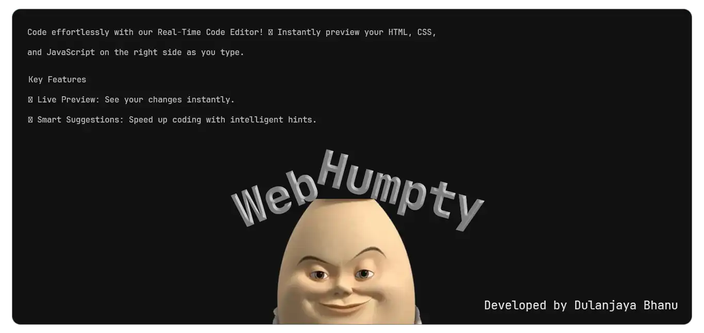
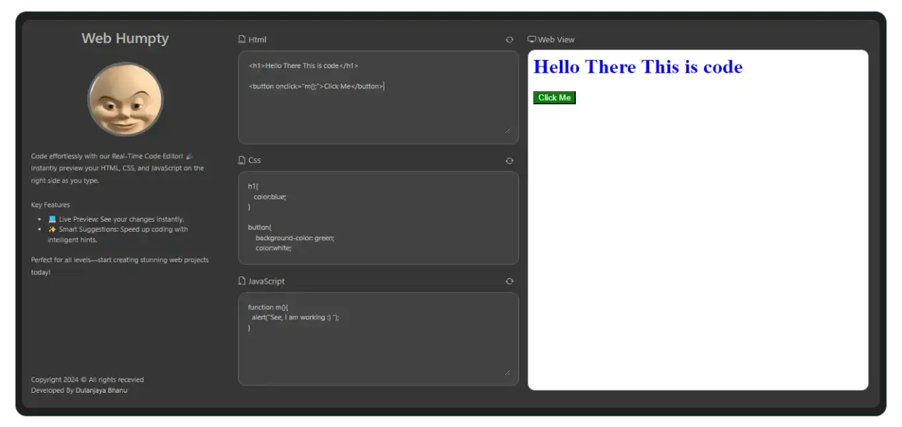
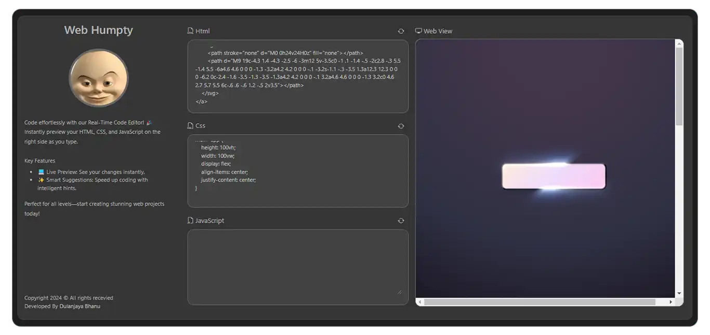
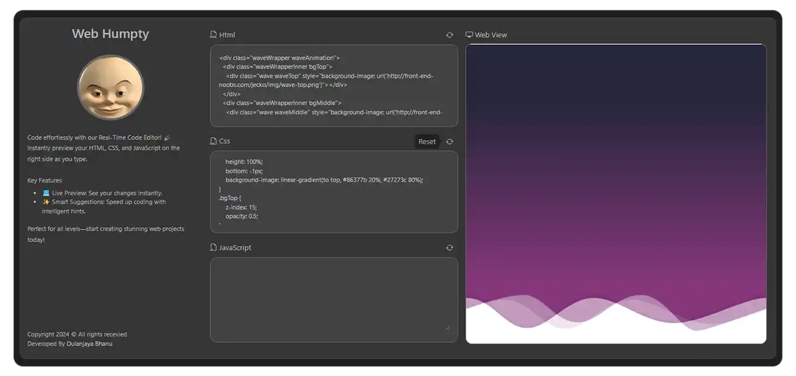
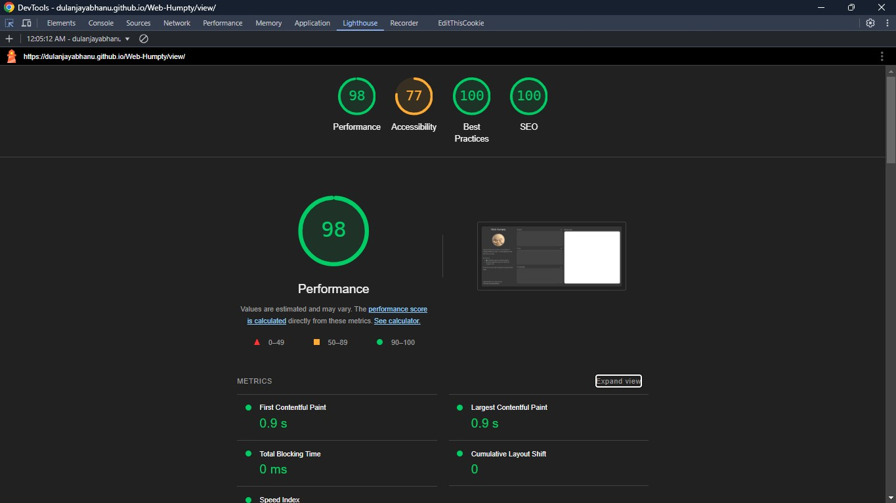

# 🌐 Web Humpty

<div>
  
</div>

**Web Humpty** is your ultimate real-time code editor, designed for developers who crave efficiency and creativity. Whether you're working on HTML, CSS, or JavaScript, Web Humpty offers a seamless experience with instant feedback, smart suggestions, and a beautifully integrated workspace. 🚀

## ✨ Features

- **🔍 Real-Time Preview**: No need to refresh! Instantly see your changes reflected in the live preview panel as you code.
- **💡 Smart Code Suggestions**: Get intelligent hints and auto-completions that speed up your coding process and reduce errors.
- **🎨 Unified Workspace**: Enjoy a streamlined interface where you can write HTML, CSS, and JavaScript in one place.
- **🚀 Fast & Lightweight**: Built for speed, Web Humpty loads quickly and handles large projects with ease.
- **📱 Fully Responsive**: Code on the go with a responsive design that works beautifully on any device.
- **🌐 Cross-Browser Compatibility**: Ensures your web projects work flawlessly across all major browsers.
- **🛠️ Developer-Friendly**: With shortcuts and tools designed for professionals, Web Humpty makes coding more productive and enjoyable.

## 🖼️ Screenshots

Take a closer look at what **Web Humpty** has to offer:

1. **✨ Main Interface**: A clean, intuitive layout that keeps you focused on coding.
   <div>
    
   </div>

2. **🔍 Live Preview**: Instant feedback with a split-screen preview of your work.
   <div>
    
   </div>

3. **💡 Code Suggestions**: Smart hints that make coding faster and more accurate.
   <div>
    
   </div>

## 📦 Installation

Getting started with **Web Humpty** is simple! Just follow these steps:

1. **Clone the repository**:
    ```bash
    git clone https://github.com/your_username/web-humpty.git
    cd web-humpty
    ```

2. **Open the `index.html` file** in your favorite browser to start coding.

3. **Optional**: For a more integrated experience, run the project with a local server.

## 🚀 Usage

**Web Humpty** is designed to be as intuitive as possible:

<div>
    
</div>

<br/>

1. **Start Coding**: Type your HTML, CSS, or JavaScript code in the editor panel.
2. **Instant Feedback**: Watch your code come to life in the real-time preview panel on the right.
3. **Smart Suggestions**: Utilize the smart code suggestions to enhance your coding speed and accuracy.
4. **Customizable Themes**: Choose from a variety of themes to make your coding environment your own.

## 🤝 Contributing

We’re excited to have you contribute to **Web Humpty**! Here's how you can get involved:

1. **Fork the repository** to your GitHub account.
2. **Create a new branch** for your feature or bug fix:
    ```bash
    git checkout -b feature-branch-name
    ```
3. **Make your changes**, and ensure they’re well-tested.
4. **Commit your changes** with a clear, descriptive message:
    ```bash
    git commit -m "Description of feature or fix"
    ```
5. **Push your branch** to GitHub:
    ```bash
    git push origin feature-branch-name
    ```
6. **Open a pull request**, and describe the changes you’ve made.

We review contributions regularly, and we’re always thrilled to see new features, improvements, and bug fixes!

## 📄 License

**Web Humpty** is released under the [Apache3.0 License](LICENSE). This means you’re free to use, modify, and distribute this software, as long as you include the original license.
